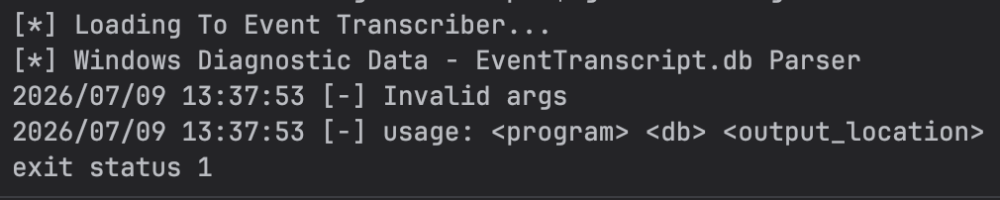
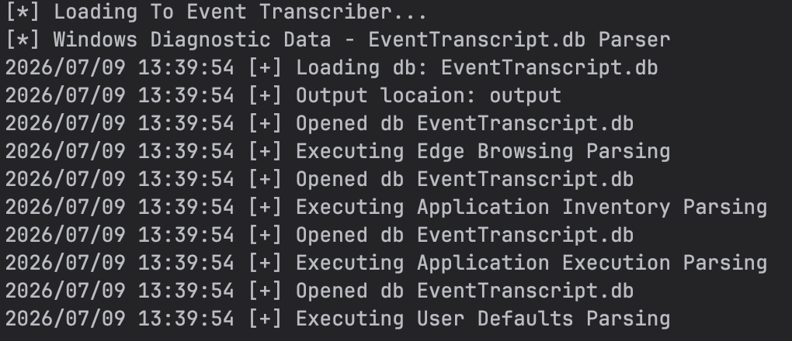

# EventTranscript Parser

**EventTranscriber** is a Golang tool to extract forensics data from Eventranscript.db (Windows Activity Timeline).

The database is located at `C:\ProgramData\Microsoft\Diagnosis\EventTranscript\EventTranscript.db`.

## This tool currently parses the following data from Eventrnscript.db:
    * Microsoft Edge browsing history
    * application inventory
    * Wireless scan results.
    * successful WiFi connection events
    * User's default preferences (Video player, default browser etc...)
    * SRUM information
    * Application execution
    * Application network usage
    * Application execution activity

## Requirements

Golang 1.26

## Dependencies

These are the required golang libraries needed to run this script.

+ csv
+ os
+ sql

## Usage

This is a CLI based tool.
### Supports:
    Golang

### Golang

may need to install sqlite library
listed in go.mod file
```bash
go mod tidy
```

```bash
go build .
$ ./main <program> <db> <output_location>
```

or

```bash
$ .go run . <program> <db> <output_location>
```



Running Example



## References

Here are some of the resources referred while making this tool.

This tool wouldn't have been possible without the excellent research & hard work put in by my colleagues Andrew Rathbun & Josh Mitchell in investigating the Windows Diagnostic Data.

Read more about their research here - https://github.com/rathbuna/EventTranscript.db-Research

Follow the investigative series at Kroll on EventTranscript.db - https://www.kroll.com/en/insights/publications/cyber/forensically-unpacking-eventtranscript

Thanks to everyone for making their research public, this tool wouldn't be possible with out that.

## Author 👥

mwcsur@gmail.com
